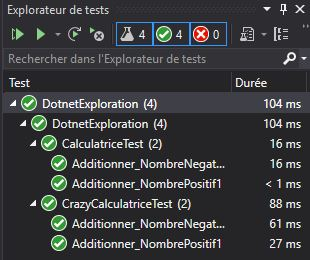

# Dotnet experimentation
Repos contenant le code d'expérimentation avec Automapper, le TDD et les performance.

## But
Création d'une classe calculatrice en mode TDD et d'une variante avec un découpage de type 'entreprise'

## Structure
- Calculatrice.cs : Classe calculatrice simple codé en mode TDD
- CalculatriceTest.cs : Classe de test unitaire de Calculatrice.cs
- CalculatriceService.cs : Implémentation de ICalculatriceService
- CrazyCalculatrice.cs : ...
- ICalculatriceService.cs : Interface
- MapperAutoDataAttribute.cs : Préparation des configurations pour l'injection des dépendances
- InlineMapperAutoDataAttribute.cs : Utilisation de InlineData avec autofixure

## Modèles de données
3 couche de classe de modèle on été créé, chaqu'un possédant sont type pour les intrants et sont types pour les extrants

## Performance

Sur mon laptop, il y a un bonne écart entre la version simple et la version complexe.

